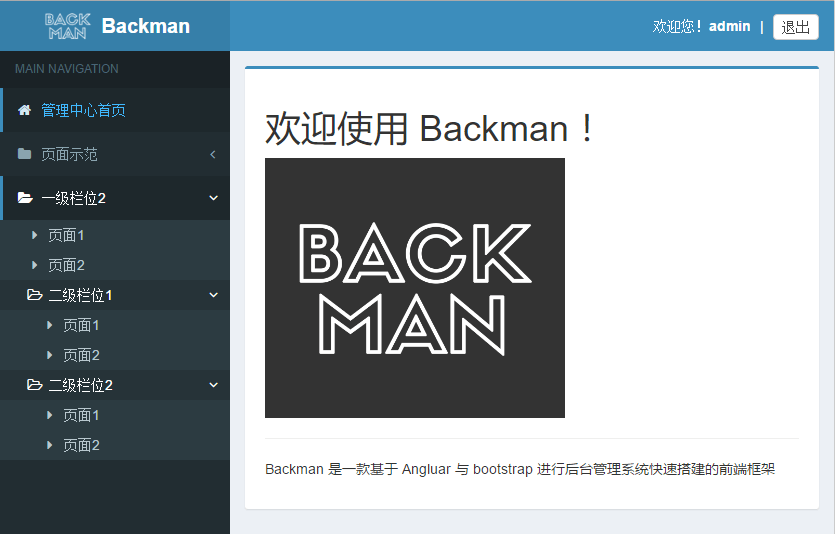

# Backman
基于 Angluar 与 Bootstrap 进行后台管理系统快速搭建的前端框架

  

## 如何开始
1. (全局)安装/升级 `npm install backman -g` 
2. 在需要的位置新建文件夹，并在当前新建的文件夹打开命令窗口
3. 在当前文件夹创建项目 `backman init`
4. 预览当前项目 `backman run`
5. 更新当前项目的框架文件 `backman update`

